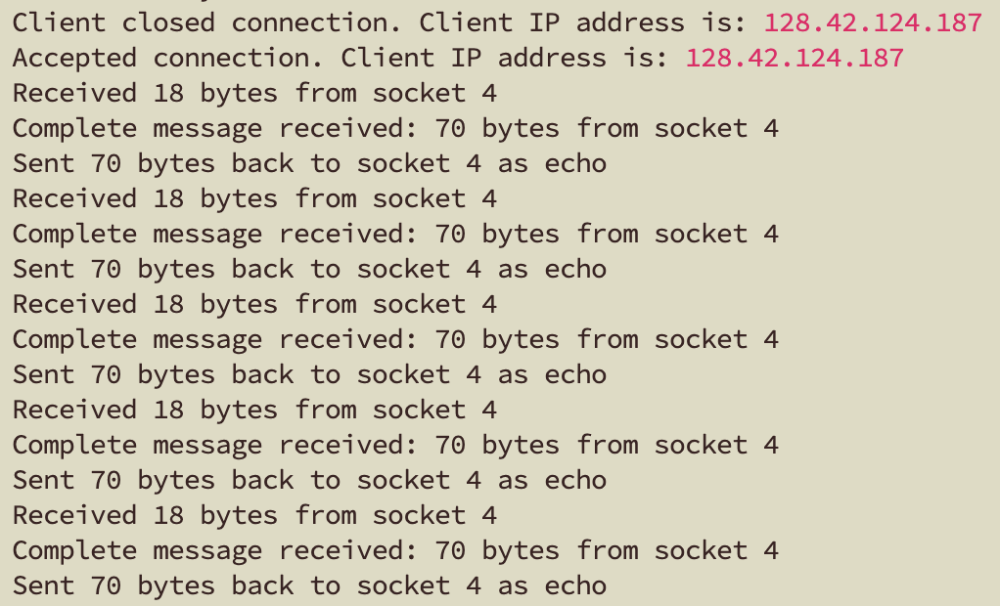
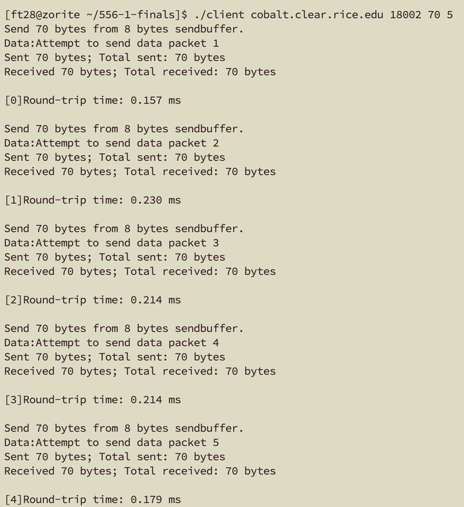

# COMP556_Project1

## Project Contributors
- Fei Teng (ft28@rice.edu)
- Jiawen Wang (jw223@rice.edu)
- Siyu Chen (sc302@rice.edu)
- Lingyi Xu (lx28@rice.edu)

## Preview
Here's a preview of what our program will look like：

Server：

Client:

## Client and Server Testing

### Testing Procedure
The client-server application was tested under a range of conditions to evaluate its performance, focusing on both normal and edge cases. The testing was conducted in the following manner:

1. Test Case Coverage:
   - Message sizes varied from 1000 bytes to 65,000 bytes with increments of 500 bytes.
   - Each message size was tested with 20 iterations to ensure consistent results.
   - Average latency was measured to analyze the bandwidth-dependent and bandwidth-independent delays.

2. Concurrency(`script_concurrency.sh`):
   - Using & to Run in the Background：In bash, we append & to a command to run each ./client in the background asynchronously, enabling concurrent execution. & sends each command to the background. The wait command will cause the script to pause until all background tasks are finished.
   - For simplicity, this script runs on "zorite.clear.rice.edu:18227".  

3. Outlier handling:
   - The outlier handling was done by averaging multiple measurements for each message size and using linear regression to smooth any discrepancies caused by abnormal network or system conditions.

4. Test Environment:
   - Tests were conducted on the CLEAR servers in a controlled environment.

### Known Problems
   - Over Simplified Error Output: All unexcepted errors will call the "Core Dumped" error log, which makes debugging and bug-fixing quite hard. We tried our best to add more error cases as many as possible to improve that.
   - Large Message Size Variability: For larger message sizes, such as those close to the upper limit (e.g., 65,000 bytes), we observed some fluctuations in average latency that may be caused by temporary network congestion.
   - System Limitations: The performance of the client-server model is dependent on the CPU load of the CLEAR servers. During periods of high server activity, average latency may vary more than expected.

### Notes 
   - The script code uses linear regression for fitting the message size versus average latency data to estimate bandwidth and fixed delays.
   - The `result.txt` file contains the raw average latency measurements, and the analysis script plots the data and fits it to a linear model for interpretation.
   - The bandwidth and fixed delay estimation can be reviewed in the code output or the accompanying plot.
   - The client file and script files need to be used in conjunction with the `result.txt` file (the results of the run need to be output in `result.txt`).
   - The test cases used for the linear fit plot in  `part2.pdf` are $SIZES=$((seq 1000 200 65000))$, $COUNT=$((seq 20 0 20))$.