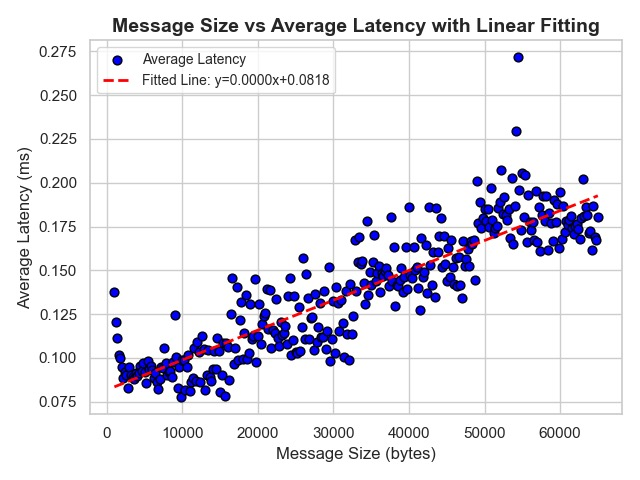

# Part 2: Network Performance Measurement Plan

## 1. Task Definition
Use the ping-pong client/server program to measure the bandwidth-independent delay between two CLEAR servers. Estimate the bandwidth-independent delay as accurately as possible and use this result to calculate the actual network bandwidth.

## 2. Basic Idea
We model the **Total Delay** as a linear function of the Message Size, which decomposes the delay into two distinct components: **bandwidth-dependent** and **bandwidth-independent delays**. The linear model provides an intuitive framework for understanding and quantifying these components. The equation for total delay can be expressed as:
$$
D = aS + b
$$
Where:
- $D$ is the observed average latency in milliseconds (ms) for sending and receiving a message.
- $S$ is the message size being transmitted, measured in bytes.
- $a$ is the bandwidth-dependent delay coefficient.
- $b$ is the bandwidth-independent delay (in ms), which remains constant.

### 2.1 **Bandwidth-dependent transmission delay (aS)**
The transmission delay increases with message size. It can be approximated as:
$$
Transmission\ Delay = a \times S = \frac{S}{Bandwidth}
$$
The larger the message size ($S$), the longer the transmission delay. The $a$ represents how much the delay increases per unit of message size.

### 2.2 **Bandwidth-independent delay (b)**
This delay includes factors like the time required for data propagation over the network, software overhead, and other fixed delays. This delay is not affected by the message size and remains constant for all measurements.

To estimate the bandwidth-independent delay, we first need to estimate the bandwidth-dependent delay through experiments, then remove outliers from the data and apply linear fitting.

## 3. Measurement Process
The measurement process is structured into three main stages: **Latency Measurement**, **Data Analysis**, and **Plotting and Fitting**. We use The `script_independent.sh` to conduct multiple test cases in one time. For simplicity, this script runs on "zorite.clear.rice.edu:18227".   

### 3.1 Latency Measurement

We conducted experiments on the CLEAR server by repeatedly sending messages ranging from 18 bytes to 65,535 bytes. Considering that network performance fluctuates under different conditions, we perform multiple latency measurements for each message size to ensure statistical reliability. The following C++ code was used to measure the average latency for each message size:

```C++
  float sum = 0.0;
  for (int i = 0; i < count; i++)
  {
    memset(buffer, 1, size); //randomize buffer
    memset(sendbuffer, 0, 18);
    gettimeofday(&start, NULL);                             // get current time
    *(uint16_t *)(sendbuffer) = htons(size);                // store size
    *(int64_t *)(sendbuffer + 2) = htobe64(start.tv_sec);   // store tvsec
    *(int64_t *)(sendbuffer + 10) = htobe64(start.tv_usec); // store tvusec

    int totalSent = 0, bytesSent;
    while (totalSent < size)
    {
      bytesSent = send(sock, sendbuffer + totalSent, size - totalSent, 0);
      if (bytesSent < 0)
      {
        perror("send() failed");
        free(sendbuffer);
        free(buffer);
        close(sock);
        exit(EXIT_FAILURE);
        break;
      }
      totalSent += bytesSent;
    }

    int totalReceived = 0, bytesReceived;
    while (totalReceived < size)
    {
      bytesReceived = recv(sock, buffer + totalReceived, size - totalReceived, 0);
      if (bytesReceived < 0)
      {
        free(sendbuffer);
        free(buffer);
        close(sock);
        exit(EXIT_FAILURE);
      }
      else if (bytesReceived == 0)
      {
        free(sendbuffer);
        free(buffer);
        close(sock);
        exit(EXIT_FAILURE);
      }
      totalReceived += bytesReceived;
    }

    struct timeval end;
    gettimeofday(&end, NULL); // Record end time

    // Calculate the round-trip time in milliseconds
    double rtt = (end.tv_sec - start.tv_sec) * 1000.0 +
                 (end.tv_usec - start.tv_usec) / 1000.0;
    sum+=rtt;
  }
  float avg = sum/count;
  printf("Average Round-trip time: %.03f ms\n",avg);
```

### 3.2 Mathematical Analysis
As described earlier, we calculate the latency and transmission time as follows: 
<!-- 总延迟 = 带宽独立延迟 + 带宽相关传输延迟
传输时间 = 消息大小 / 带宽  -->
- $Total\ delay = Bandwidth\text{-}independent\ delay + Bandwidth\text{-}dependent\ transmission\ delay$
- $Transmission\ time = \frac{Message\ size}{Bandwidth}$

The linear fitting approach assumes that outliers (due to network congestion or fluctuations) will be handled by averaging and fitting the data, which allows for a more accurate estimate of the bandwidth-independent delay.

### 3.3 Plotting and Fitting

A scatter plot is created with message size ($S$) on the x-axis and average latency ($D$) on the y-axis. We use the Python's **linregress** function. The linregress function performs a striaghtforward implementation for linear regression, which is computationally efficient for large datasets.

According to data analysis, ideally, latency should increase linearly with message size. The bandwidth-independent delay is represented by the intercept of the graph (the delay when the message size is zero). The bandwidth-dependent delay is calculated from the slope of the line, with the formula $Bandwidth = \frac{Change\ in\ message\ size}{Change\ in\ latency}$.

```python
import re
import numpy as np
import matplotlib.pyplot as plt
from scipy.stats import linregress
import seaborn as sns


# Parse the txt file
def parse_file(file_path):
    with open(file_path, 'r') as file:
        data = file.readlines()

    sizes = []
    latencies = []

    for line in data:
        match = re.search(r'Size = (\d+) bytes, .* average latency = ([\d.]+) ms', line)
        if match:
            size = int(match.group(1))
            latency = float(match.group(2))
            sizes.append(size)
            latencies.append(latency)

    return sizes, latencies


# Take the average latency for every 5 data points with the same size
def average_latencies(sizes, latencies):
    avg_sizes = []
    avg_latencies = []
    unique_sizes = sorted(set(sizes))

    for size in unique_sizes:
        latency_values = [latencies[i] for i in range(len(sizes)) if sizes[i] == size]
        for i in range(0, len(latency_values), 5):
            avg_sizes.append(size)
            avg_latencies.append(np.mean(latency_values[i:i + 5]))

    return avg_sizes, avg_latencies


# Fit and plot the data
def plot_fitting(avg_sizes, avg_latencies):
    # Set plot style
    sns.set(style="whitegrid")

    # Perform linear fitting
    slope, intercept, r_value, p_value, std_err = linregress(avg_sizes, avg_latencies)

    # Plot data points with smaller marker size
    plt.scatter(avg_sizes, avg_latencies, color='blue', label='Average Latency', edgecolors='black', s=40)

    # Plot the fitted line
    fit_line = [slope * size + intercept for size in avg_sizes]
    plt.plot(avg_sizes, fit_line, color='red', linestyle='--', linewidth=2,
             label=f'Fitted Line: y={slope:.4f}x+{intercept:.4f}')

    # Set labels, title, and legend
    plt.xlabel('Message Size (bytes)', fontsize=12)
    plt.ylabel('Average Latency (ms)', fontsize=12)
    plt.title('Message Size vs Average Latency with Linear Fitting', fontsize=14, fontweight='bold')
    plt.legend(loc='upper left', fontsize=10)

    # Add grid
    plt.grid(True)

    # Display the plot
    plt.tight_layout()
    plt.show()

    return slope, intercept


# Main function
if __name__ == '__main__':
    file_path = "result.txt"
    sizes, latencies = parse_file(file_path)
    avg_sizes, avg_latencies = average_latencies(sizes, latencies)
    slope, intercept = plot_fitting(avg_sizes, avg_latencies)
    print(f"slope: {slope:.10f} bytes/ms, intercept: {intercept:.3f} ms")
```

<p align="center">
  
</p>

This plot illustrates the linear relationship between message size (bytes) and Round-Trip Time (RTT, milliseconds). The linear fitting results are: slope: 0.0000016977 bytes/ms, intercept: 0.0818 ms.
- Slope: Represents the bandwidth-dependent delay, which is very small, indicating that the latency increases only slightly as the message size grows. The estimated bandwidth is relatively high, showing that the network has a strong data transmission capacity.
- Intercept: Represents the bandwidth-independent fixed delay, reflecting the constant network overhead that doesn't change with message size.

In the plot:
- Most data points are clustered around the fitted line, suggesting a good linear relationship between message size and average latency.
- Outliers: At larger message sizes, there are some visible fluctuations and outliers, likely caused by transient network congestion or external factors leading to temporary anomalies.
- The points show a subtle stair-stepping shape, which may indicate the effect of packetization, where larger messages are split into multiple packets, causing slight jumps in latency as more packets are processed.


## 4. Conclusion

Through this method, we effectively measured both the bandwidth and the bandwidth-independent delay between two CLEAR servers using the ping-pong client/server program. By sending messages of varying sizes and performing linear regression on the average latency data, we were able to extract two key parameters: Bandwidth (Derived from the slope of the linear fit, this represents the network's capacity to transmit data) and Bandwidth-independent delay (Represented by the y-intercept of the fit, this reflects the fixed delay in the network due to propagation time and system overhead). In real-world scenarios, additional factors like router processing time and system call delays could affect these measurements, but they were not considered in this experiment. Nonetheless, this methodology provides an accurate and efficient way to estimate network performance parameters.

<script type="text/javascript" src="http://cdn.mathjax.org/mathjax/latest/MathJax.js?config=TeX-AMS-MML_HTMLorMML"></script>
<script type="text/x-mathjax-config">
  MathJax.Hub.Config({ tex2jax: {inlineMath: [['$', '$']]}, messageStyle: "none" });
</script>
